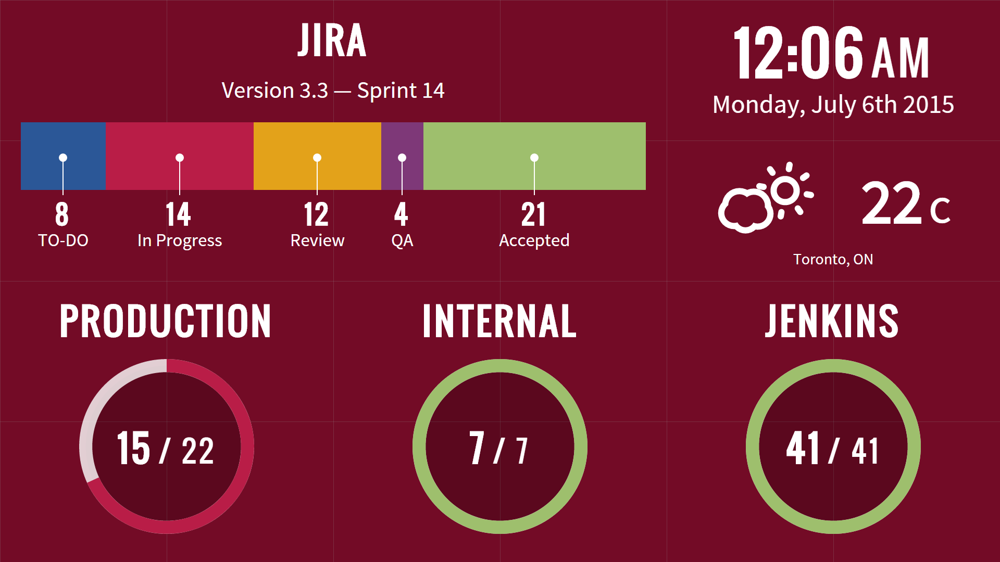

[](https://david-dm.org/hhaidar/flow)
[](https://david-dm.org/hhaidar/flow#info=devDependencies)



## Setup

Clone le repo:

```
git clone https://github.com/hhaidar/flow.git
cd flow
```

Get gulp:

```
npm install -g gulp
```

Party time:

```
npm start
```

## Development

You can build assets by running `gulp`. They are served from `client/build`

## Writing Services

Built-in services are located in `server/lib/services/built-in`. They consist of a `contstructor` and `fetch` method.

```
'use strict';

var Forecast = require('forecast');

function Provider(options) {

    this.options = options;

    this.client = new Forecast({
        service: options.source || 'forecast.io',
        key: options.key,
        units: 'celcius',
        cache: true,
        ttl: {
            minutes: 30
        }
    });

}

Provider.prototype.fetch = function(done) {
    this.client.get(this.options.location, function(err, data) {
        done(err, data);
    });
};

module.exports = Provider;
```

## Task files

Services do not actually run on their own. You'll need to create a task file in `/tasks` that calls the service and passes it whatever options it needs (interval, api key, etc..)

Here's what a task file looks like:

```
id: weather-toronto # unique identifier used by the frontend
service: weather # this is the service name
interval: 30 minutes

# custom options passed into the service
location: [43.6482, -79.3887]
source: forecast.io
key: blahblah
```

## Running tasks

You actually don't have to run the server to see what a service will fetch.

There's a handy command-line tool available and here's how to use it:

```
node manage.js run ./tasks/weather.yml
```

```
Running [weather-toronto]
{ summary: 'Partly Cloudy',
  icon: 'partly-cloudy-day',
  temperature: 23.62,
  timezone: 'America/Toronto' }
```
